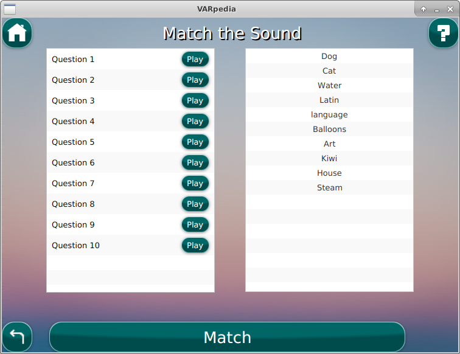
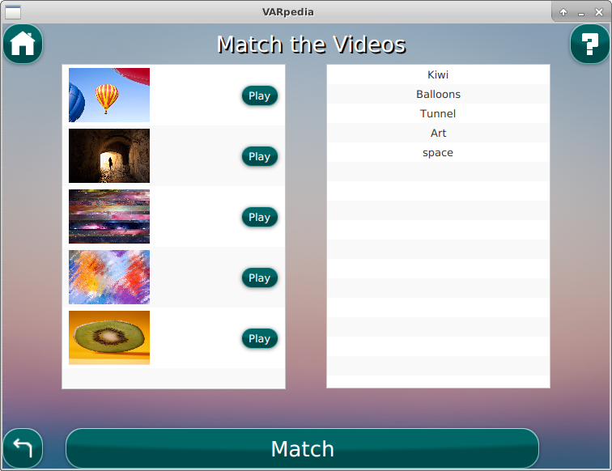
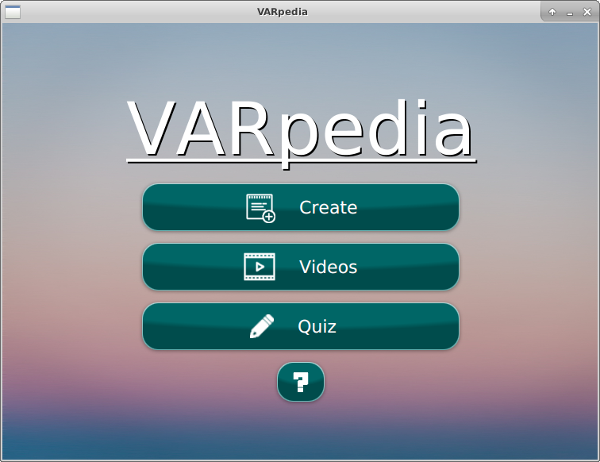
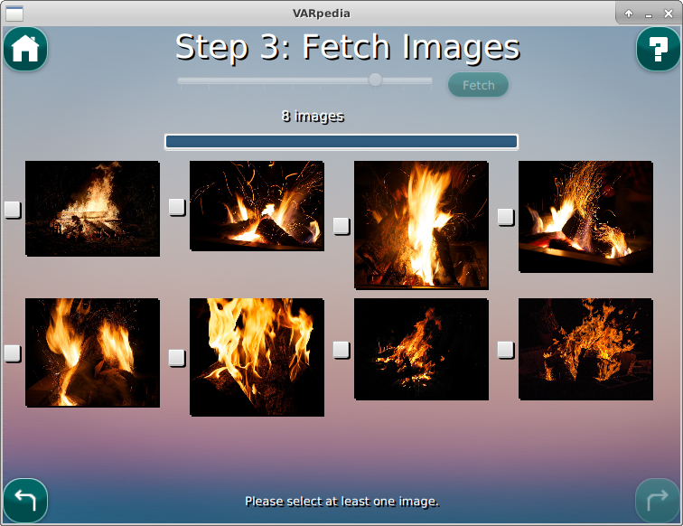

# 206-Project

## Discussion Wiki

### 18/10/2019 @ 1544 - So Much of Everything

This is the post where we talk about everything we have implemented and what we intend to finish up and fix.

**1. GUI Overhaul**

We decided together that the Teal Sunset theme of [Assignment 3](https://github.com/dongmeilim/Assignment_3_206) would not work as our stake holder is a child. With this in mind, we got posted some suggestions for background images taken from [unsplash](https://unsplash.com/).

I initially put up some images with vibrant background.


However upon reflection we both agreed that it should be a bit plainer; "bright, but just a few colours".


We chose the baby blue background with the yellow origami boat.

Then we set out to make this a theme, very similar to last time. Here's what we have for our map.


Noteworthy changes:

* Help Buttons implemented.
* Thumbnails added for `VideoList.fxml`.
* Changed icons to match video-game-esque help button.
* Decided against using text under labels as it stretched the button out of proportion.
* Decided against changing the headings, it being unnecessary.
* Decided against progress bar in `QuizSettings.fxml`, it being unnecessary.
* Background music implemented and attribution appears on the video when used.
* Reset button implemented for `TextSelect.fxml`.

Extra changes to be made:

* Bind buttons to keyboard
* Implement Safesearch

**2. User Testing Feedback**

@dongmeilim's brother tested our application and remarked that it was unintuitive to him that Stop needed to be pressed before making another preview.

In light of this, we will change the Preview button to have the following functionality.

* Preview will dispose after one-time play for quick and instant previews.
* While playing, the Preview button will simply show the Stop text instead of splitting up into two buttons (Stop, Play).

**3. Peer Review Feedback**

We recently received some [peer review feedback](Misc/PeerReviewFeedback_Summarised.md).

Overall they complimented the User Interface but the majority of the reviewers couldn't actually make a creation. This is most likely due to the fact we didn't test the runnable.jar of the application before submitting due to lack of time.

Compiled at the end of the post are some bugs that we still need to fix.

**4. Began work on the manual**

As part of our submission for the project, we need to submit a manual. We've currently drafted up some headings.

```
1. How to Install
2. How to Run
3. Key Words (Glossed) Optional

4. What to Do - Introduction
 4a) Create Videos - map
 4b) Watch Videos
 4c) Do the Quiz - map

FAQ & Troubleshooting (Contacts?)

Appendix
 Full screen diagram
```

**Table of Bugs**

| Where is it?                                                            | What happens?                                                                               |
|-------------------------------------------------------------------------|---------------------------------------------------------------------------------------------|
| PreviewSave.fxml                                                        | Duration is 00:00 until play button is pressed.                                             |
| PreviewSave.fxml, VideoPlayer.fxml                                      | Slider jumps around upon repeated presses of play and pause.                                |
| ~~Arriving in TextSelect.fxml after checking music in ImageFetch.fxml~~ | ~~Concatenated files appear in the table.~~                                                 |
| Application/quiz/                                                       | When a creation is deleted, the corresponding quiz directory is not deleted.                |
| ~~*Match.fxml~~                                                         | ~~Matching should be case-INsensitive in the case of similar creations.~~                       |
| ~~(JAR) ImageFetch.fxml~~                                               | ~~LoadException when trying to progress to PreviewSave.fxml~~                               |
| ~~(JAR) Menu.fxml~~                                                     | ~~When there are less than 2 creations, pressing Help repeatedly enables the Quiz button.~~ |
| (JAR) Search.fxml                                                       | Repeatedly searching unknown terms is accepted. (unable to recreate)                        |
| ~~(JAR) VideoPlayer.fxml~~                                              | ~~Leftover images remain in new creations.~~                                                |
| ~~(JAR) Search.fxml~~                                                   | ~~Users can enter -version and -help and it is accepted.~~                                  |

\- Mirlington

---

### 12/10/2019 @ 2330 - Matchmaker

We've been working on a few things since last time. Since the circumstance is that we are now in proximity, we have been working on many shorter branches and merging frequently. Here are some things we have implemented.

**File Hierarchy**

We needed to make a file hierarchy for the quiz games so that designing would be easier.


The idea is that the creations are loaded randomly using our `listDirectory` method among other things. Then for each random creation chosen, the query is read and the appropriate media is chosen e.g. if the quiz is in Audio Only mode then the `.wav` is chosen.

**The Quiz**

I was tasked with working on the ImageMatch and VideoMatch windows, while @dongmeilim worked on the AudioMatch and the Scoring system. Originally we had 50x50 shown for the Image and Video windows, but we agreed this was too small. Here are the windows:






**Scoring**

The Scoring was relatively simple to implement, though we decided on replacing the columned labels to Perfect and Needs Work.

The System is that if you get it wrong at least once then it will be put into the Needs Work section. We talked about including lives but decided it would be better off if we implemented infinite retries. ScrollPanes were also added to account for no upper bound on number of questions.

**Background Music**

We retrieved the background music from [http://ccmixter.org](http://ccmixter.org). I added a checkbox inside ImageFetch so that the user may indicate if it is wanted or not. In this manner, adding a song is quick and easy and flows nicely with the no-complication style that is the rest of the app.

**Help System Layout**

Although not completed this implementation yet, we have an idea for how this will be implemented.

* HBox
 * StackPane
  * BorderPane
  * AnchorPane

The Help Button will toggle between the children of the StackPanes.

Quick Fixes

* Removed horizontal scrollbars on the TableViews.
* Made sure that onClickEvents will wipe error labels for smooth flow.
* Renamed Both to Full Video.

**Need to Implement**

1. rename other steps to be more playful (to match - Create The Sound)
2. Labels for icons
3. Fix help icon in Menu
4. Attribute the artist of the track on Menu
5. Implement a kid-like CSS for our stakeholder.

\- Mirlington

---

### 09/10/2019 @ 1739 - Let the Games Begin

Finally have the TextSelect step (now renamed to Create the Sound) implemented. It has been redone to remove the need to the child user to name their audio files (kids don't have that kind of patience), as well as add the ability to play and delete saved audio files. The audio slider has been removed as it took up too much precious space in the window. The play/pause/stop controls should be enough for the child. The voices have also been given more descriptive(?) names.

Here's how the window looks currently:


With this done, more of my focus can be put on the game component now :D

\- dongmeilim

---

### 08/10/2019 @ 1553 - Rain Cloud Under The Honey Tree

`MirlingtonWindows` was finished sooner than I expected. Here's a look at the Save Video step:


Here are some other things we agreed on while coding:

1. A loading icon is needed before navigating to the Save Video step.
2. We need to download a blacklist file of inappropriate words so that we can prevent the child from searching up them. This should be done by a simple `for` loop with `BufferedReader`.
3. A `quiz` branch will be made while we work on the quiz together
4. Decided on some fresh icons for the Menu screen, see below:



\- Mirlington

---

### 06/10/2019 @ 2015 - The Branch Less Traveled

Today I branched off from `master` into `MirlingtonWindows`. When I finally dug my hands into some code, I noticed there were things we could improve on from last time:

1. We've proposed to make a `quiz` branch off `master` so upon which we can work on together.
2. Simplified the Controller Class, no more `switchNonSkippableWindow` among other things.
3. We switched to a `750x550` resolution to get a better landscape look and feel.

Other things:

* We agreed on one-liner methods, so long as they're simple and commonly used.

**The Simplified Creation Cycle**

1. Search Word.
2. Create Audio.
3. Fetch Images.
4. Save Video.

Today I was able to get step 3 done, take a look.



I can't believe it looks that great and we're still using the old design!

\- Mirlington

---

### 06/10/2019 @ 1034 - Hauling Over and Under

**Introduction**

Before I begin, I'd like to point out that this project builds upon the foundations of our [third assignment](https://github.com/dongmeilim/Assignment_3_206).

Compared to last time we have a [hefty brief](Misc/project_brief.pdf) as we are now developing for a stakeholder - a child user 7-10 years - so along the process of design we will strive to envision their user story.

**Functionality**

Yesterday @dongmeilim and I met up to discuss the functionality, and while we were making decisions, I mocked up sketches in my workbook.

*Some key decisions we made along the way:*

A help button will be on every window for instant convenience, we thought this would appeal to a kid. When clicked, extra information will be overlayed on the current window.

Buttons will always appear in the same place, just like last time.
  * Home Button on top left (Except for Menu)
  * Back Button on bottom left (Where appropriate)
  * Next Button on bottom right (Where appropriate)
  * Help Button on top right (Always)

We received a global [presentation feedback](Misc/PresentationFeedback.md) from our lecturers, from this we decided to implement the following:
  * Have a reset button for wikit text
  * When you pause the video - save the time, when you play the video, load the time
  * Bind buttons to keys for everything
  * Preview video before saving
  * Voice names - more descriptive (kaldiphone means nothing to the user)
  * Warn the user preemptively that the NZ voice cant pronounce a lot of words.

In the [brief](Misc/project_brief.pdf) we chose to create a matching game, to be more appealing to the stakeholder.
  * Options:
    * Audio only
    * Images only
    * Both
  * Searched-term will be redacted from the media during the matching game.
  * The quality of the quiz depends on the quality of the creation, so we wish to discourage the user from making trivial videos, e.g. one-word narrated only.

Like last time we will implement the UI and functionality first before making the app pretty with CSS.

**After the meeting, I took to the computer to make the map**


We've removed a lot of steps from our previous assignment; we believe that just the core features will appeal to the kid the most.

We have also omitted the video-list and video-playback section of the screendiagram, this is because we intend it to be almost identical, except that this time we wish to show video thumbnails in the video-list.

\- Mirlington
